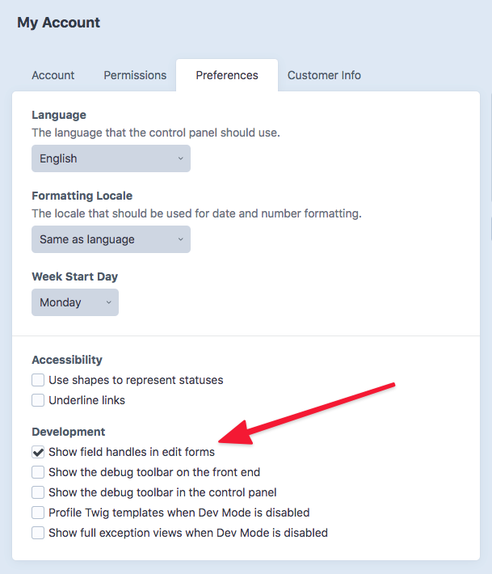

# CP Field Inspect plugin for Craft CMS 3.x

[](https://scrutinizer-ci.com/g/mmikkel/CpFieldInspect-Craft/?branch=master)

CP Field Inspect is a tiny utility plugin making content modelling a little bit easier in Craft.  

The plugin adds a little cogwheel link to the field handles in element edit forms. Clicking this link redirects you to the fields' settings pages - and back to your content when you save the settings.  

Additionally, CP Field Inspect will add a link to your element edit forms for easy access to the element's source settings. This enables you to quickly tweak e.g. a entry type's field layout. And just like with the field settings, after saving the source settings CP Field Inspect redirects you back to the element edit page.  

_For Craft 3.0-3.4, CP Field Inspect also adds the field handle to the edit form. Since Craft 3.5 the field handles display as a core feature, and CP Field Inspect only adds the actual links._


Plugin icon: CUSTOMIZE SEARCH by creative outlet from [the Noun Project](https://thenounproject.com)

## The caveats!  

CP Field Inspect will only add field settings links and element source buttons to your edit forms if  

* The logged-in user is an **admin**  
* The "Show field handles in edit forms" admin user preference is enabled (Craft 3.5.4+)  
* [`allowAdminChanges`](https://craftcms.com/docs/3.x/config/config-settings.html#allowadminchanges) is `true`  

If any of the above are false, CP Field Inspect will do absolutely nothing.  

## Requirements

**This plugin requires Craft CMS 3.5.4 or later.**

If you're on 3.4.2 or later, you should install CP Field Inspect v. 1.1.3:

    composer require mmikkel/cp-field-inspect:1.1.3  

Older Craft 3.x installs should install CP Field Inspect v. 1.0.7:

    composer require mmikkel/cp-field-inspect:1.0.7  

Looking for the Craft 2 version? [It's right here](https://github.com/mmikkel/CpFieldLinks-Craft).

## Installation

To install the plugin, follow these instructions.

1. Open your terminal and go to your Craft project:

        cd /path/to/project

2. Then tell Composer to load the plugin:

        composer require mmikkel/cp-field-inspect

3. In the Control Panel, go to Settings → Plugins and click the “Install” button for CP Field Inspect, or install via the CLI: `./craft plugin/install cp-field-inspect`

## Cogwheels not appearing?  

If you're on Craft 3.5.4 or later, make sure the admin user preference "Show field handles in edit forms". If `allowAdminChanges` is `true`, the cogwheels _should_ appear at that point.  

  

### Still nothing?  

If the cogwheels don't appear if you're logged in as an admin, `allowAdminChanges` is true _and_ the "Show field handles" user preference is enabled, the reason is most likely due to the site having one or several plugins or [custom modules](https://docs.craftcms.com/v3/extend/module-guide.html) installed, that call `Craft::$app->getUser()->getIdentity()` or related methods from within their constructor or `init()` methods. This has been confirmed, due to [a bug in Craft](https://github.com/craftcms/cms/issues/2473), to prevent CP Field Inspect from displaying the cogwheels, since `Craft::$app->getUser()->getIsAdmin()` will actually return a false negative in plugins, in this scenario.  

The workaround is to defer any calls to `Craft::$app->getUser()` (such as `Craft::$app->getUser()->getIdentity()` etc) in the offending custom module to the `Plugins::AFTER_LOAD_PLUGINS` event; essentially letting plugins like CP Field Inspect load before calling that method (in Craft 3, modules are loaded before plugins).  

Here's how the workaround can look (the below would go in your custom module's primary class):

```php
public function init()
{
    parent::init();

    // Defer further boot-up until after plugins have loaded
    Event::on(
        Plugins::class,
        Plugins::EVENT_AFTER_LOAD_PLUGINS,
        function () {
            $this->doIt();
        }
    );

    Craft::info(
        Craft::t(
            'my-module',
            '{name} module loaded',
            ['name' => 'My Module']
        ),
        __METHOD__
    );
}

protected function doIt()
{
    $currentUser = Craft::$app->getUser()->getIdentity();
    // ... all other logic dependant on `$currentUser`
}
```

## Disclaimer

This plugin is provided free of charge and you can do whatever you want with it. CP Field Inspect is _very_ unlikely to mess up your stuff, but just to be clear: the author is not responsible for data loss or any other problems resulting from the use of this plugin.

Please report any bugs, feature requests or other issues [here](https://github.com/mmikkel/CpFieldInspect-Craft/issues). Note that this is a hobby project and no promises are made regarding response time, feature implementations or bug fixes.

**Pull requests are extremely welcome**


